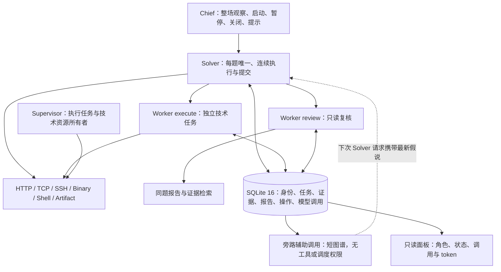

# AION：连续 Solver 与按需 Worker

本版本只使用 `chief / solver / worker` 三种角色。每题由一个持久 Solver 连续推进：它可以直接使用技术工具、读取证据、提交答案，也可以显式委派独立任务。Worker 是可选资源，简单题无需创建 Worker。

## 架构与权威状态

SQLite 是事实源。`AgentStateStore` 和会话摘要是上下文投影；模型记忆不能覆盖任务终态、平台完成状态或待确认操作。Run 保留绝对 `deadline_at`，不再按早中晚阶段改变执行机制。技术资源内部的 HTTP execution/analysis 工作项只是请求与分析队列，不是 Agent 解题阶段。

- **StateService / AgentStateMixin**：事务化身份注册、任务幂等、证据范围、报告投递、平台操作、审计和进程归属。
- **Supervisor / AgentLifecycle**：每 Agent 一个运行任务，持有技术 provider 和资源管理器。Runner 只负责一次模型会话。
- **ResourceController**：沿用 CPU、内存、磁盘准入和平台容器容量。Worker 不设单题固定并发上限。
- **Runner**：真实工具循环、精确值保护、模型错误恢复和通用会话压缩。等待与压缩不销毁技术连接。
- **Skill 目录**：Solver 与 execute Worker 共享可检索的规划和技术知识。按需检索、显式激活，不自动注入目录或候选项；已激活指令在压缩和恢复后继续保留。保留原领域目录与脚本；目录名不再决定角色权限。

## 精简上下文与旁路短图谱

Solver 默认只向模型常驻暴露基础读取、观察、等待、提交和 `tool_search`；其余授权能力通过 `tool_search(name=...)` 返回真实 Schema，下一轮直接调用原生函数。动态 Schema 最多保留 3 个并按 LRU 逐出，基础工具不占槽位。没有通用包装调用，HTTP、SSH、TCP 和二进制的会话工具仍可用，不要求通过 Shell 重建连接。

Supervisor 为每个 Solver 持有一个异步旁路观察组件。它只读取该 Solver 的分页执行事件，每批最多 80 个事件、约 16,000 字符。累计至少 6 个有效工具结果，或页面/缓冲满且有有效结果时，才允许调用一次辅助模型；两次启动至少间隔 60 秒，单次最多 20 秒且受 Run 绝对截止约束。无新执行、健康检查或纯状态轮询不触发模型。

图谱只包含 `LOCK / DEAD / ANGLES / TENSION`，各至多 2 项，附可核对的事件序号，总量至多约 1,500 个估算 token。旧结论可修改或撤销；图谱不写 Finding、不执行工具、不派发或停止任务。主线继续执行，下轮只附带最新图谱，固定系统提示前缀不因图谱变化而改写。图谱与游标存入现有 SQLite 事件表；失败保留旧图谱，暂停与终态清理取消在途请求，重启保留最新图谱与未消费轨迹。

`AION_COMPACT_TOOLS` 与 `AION_SOLVER_OBSERVATION` 默认启用，可分别关闭以做消融比较；每次启动/恢复记录实际配置。详见 [本次实现与验证](docs/AION_短图谱与精简工具.md)。旁路调用使用原配置模型和辅助 non-thinking 选项，输出上限 2,048；主线预算不变。

## 身份、启动与资源生命周期

`(run_id, unique_code)` 上的 Solver 唯一索引不含活动状态。数据库事务串行注册，返回实际 Agent ID；Supervisor 按题目和 Agent 加锁启动，能力凭据始终签发给返回的 ID。同机每个 Run 由内核文件锁保证只有一个 Runtime 监督；暂停、关闭和进程退出释放锁，第二个存活监督者不能直接接管恢复。暂停、可恢复故障和进程恢复复用原 Solver。

Chief 批量暂停题目时，默认释放靶机；`release_container=false` 保留靶机。两种方式均取消 Worker、暂停 Solver、清理该题所有技术连接。保留 Solver 身份、SQLite 记忆、证据、报告游标和待确认批次。恢复调用原启动接口，只启动原 Solver。

关闭题目是永久状态。暂停、关闭、平台完成、绝对截止和不可恢复异常统一进入幂等资源清理。各 provider 和 HTTP、网络、Shell、记录的本地进程均尝试回收；单个失败不跳过其他资源，失败写入 `agent_resource_cleanup_failed`，失败句柄保留以供重试。平台确认容器停止前，`slot_occupied` 继续为真。

进程恢复先核对未完成平台操作，再为每个未完成 Worker 写入一次 `interrupted` 终态报告，回收持久记录的二进制进程，递增技术会话代际。旧 TCP、SSH、二进制句柄明确返回 `session_invalidated`。Worker 不自动续跑，Solver 可使用新任务键重做。正常等待、压缩与可恢复模型错误复用同一代资源。

所有 Agent 受 Run 绝对截止约束。Worker 可选时限从实际执行开始计时，与整场剩余时间取较小值。排队不会延长比赛窗口；保留单次模型与工具超时。

## 控制工具与报告

| 角色 | 工具 | 行为 |
|---|---|---|
| Chief | `chief_observe / chief_launch_challenges / chief_wait / chief_request_hint` | 观察、启动或恢复、等待、提示 |
| Chief | `chief_pause_challenges / chief_close_challenges` | 批量控制，逐题返回结果 |
| Solver | `solver_observe / solver_wait` | 题目状态、分页任务账本、增量报告；无事件则挂起 |
| Solver | `solver_delegate` | 显式任务列表，含 task_key、objective、success_criteria、context_refs、mode、可选 timeout_seconds |
| Solver | `solver_cancel_worker / solver_progress / solver_submit_flag` | 分别取消、非终态进展和答案提交，无隐式联动 |
| Worker | `worker_update / worker_report` | 非终态更新与唯一终态，含结论、证据、已测/未测范围、建议及可选候选答案 |
| Solver / Worker | `evidence_search / evidence_read / report_read` | 同 Run、同题范围内检索与分页读取 |

同 Run、同题任务键唯一。同键同内容返回已有任务；不同内容返回冲突。取消或中断任务不会因重复委派重新执行。更新按调用标识与规范化内容去重；取消和终态报告由事务决定先后。迟到结果只留审计，不能改变终态、派生任务或停止主线。

`review` Worker 只有同题证据、报告检索读取和更新/终态报告工具。工具白名单与 StateService 双重限制，禁止写共享 Finding、操作目标、派发任务和提交答案。execute Worker 的 Finding 必须通过严格 Schema 与同题证据校验。

报告采用一个有序收件箱和持久待确认批次。读取时准备批次但不推进游标；只有带该 `delivery_id` 的模型响应落库后才确认。失败与重启重放原批次。等待记录序列后，通知器再次检查序列，避免报告到达与挂起之间丢失唤醒。健康检查和资源采样不产生模型唤醒。

## 答案、模型预算与统计

只有 Solver 提交答案。提交保持精确值保护、摘要去重和不确定操作只读核对。正确答案计数达到总数也不能替代平台 `is_completed`；提交后同步题目，部分正确或平台尚未确认时继续运行。详细契约见 [CHALLENGES_API.md](CHALLENGES_API.md)。

保留配置中的模型、推理设置及上下文窗口。原 Challenge 预算映射 Solver，原 Execution 预算映射 Worker：

| 角色 | 软输入预算 | 最近消息预算 | 恢复事件字符数 | 单次输出预算 |
|---|---:|---:|---:|---:|
| Chief | 128,000 | 32,000 | 48,000 | 32,768 |
| Solver | 96,000 | 24,000 | 36,000 | 32,768 |
| Worker | 64,000 | 8,000 | 24,000 | 16,384 |

默认上下文窗口 1,000,000 token。主请求保持 thinking enabled / reasoning_effort=max；维护请求保留原 non-thinking 设置。

每次物理模型请求记录 `model_call_started / model_call_finished` 与唯一调用 ID。主请求、重试、会话摘要、旁路观察、可选 Skill 发现及平台适配器辅助请求均计入。按调用 ID 去重后聚合每 Agent、每题和整场的输入、缓存命中、未缓存输入和输出。缺失值以及崩溃时只有 started 的调用显示“未知”，不填零；无调用的合计为零。

## 数据版本与验证

数据库版本固定 16。启动新 Run，不覆盖已有 Run；旧数据库拒绝恢复，不迁移、不添加兼容角色或旧接口。历史运行、原基线和本次实施前的工作树快照保留。

删除自动催报、checkpoint 续派、兄弟任务自动停止、旧 Observer Agent、Bootstrap 扩容、停滞提醒/暂停、全暂停后重启、Quiescence 门控和 BS 黑板压缩。新增旁路组件是无工具、无调度权限的辅助模型调用，系统仍只有三种 Agent 角色。通用会话 checkpoint 和技术领域中的调试 checkpoint 仍保留。

本轮交付范围为本地代码与离线验证。验收证据和环境边界见 [交付验收清单](docs/AION_交付验收.md)；性能需要另行执行 [三组成对评测](docs/paired-evaluation.md)。历史中断日志不构成本版本性能提升证据。
