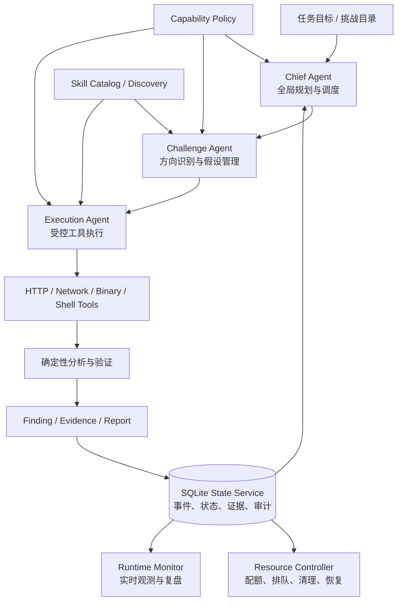

# AION：可验证、自恢复的全链路 AI 攻防 Agent

## 一、作品概述

AION 面向 SRC 定向漏洞挖掘、Web 安全分析和二进制漏洞研究等真实安全任务，目标是将大模型从“生成分析建议”升级为能够规划、执行、验证、审计和恢复的安全 Agent 系统。

作品采用 Chief Agent、Challenge Agent、Execution Agent 三层协作架构：Chief Agent 负责全局目标和资源调度，Challenge Agent 负责单个挑战的方向判断、假设管理和验证策略，Execution Agent 负责调用 HTTP、网络、二进制及系统工具完成具体操作。所有状态、工具调用、发现、证据和报告均写入统一的 SQLite 运行状态库，使任务能够在异常、部署或网络中断后安全暂停并继续执行。

AION 的核心价值不是让模型“说得更像安全专家”，而是让每一个攻击动作都能够被执行、被约束、被验证、被记录，并最终沉淀为可复现的安全证据链。

## 二、要解决的问题

传统安全自动化工具通常存在三个问题：

1. 工具链是离散的，扫描、分析、验证和报告之间缺乏统一闭环，发现结果难以自动转化为下一步行动。
2. 单 Agent 容易陷入重复尝试、上下文膨胀和错误判断，靶场容器、网络连接和并发资源也缺乏统一管理。
3. 大模型输出不可天然视为事实。面对接口漂移、异常响应、提示注入或不完整证据时，直接执行会带来误报、失控和不可复现问题。

AION 将“推理能力”“工具执行”“状态管理”“资源控制”和“证据验证”拆分为相互协作但职责清晰的模块，形成面向安全实战的 Agent Runtime。

## 三、技术架构

主要模块如下：

- **Agent Runtime**：负责一次 Run 的启动、等待、暂停、恢复、关闭和网络生命周期管理。
- **State Service**：维护 Run、Challenge、Agent、Observation、Hypothesis、Finding、Evidence、Operation 和 Audit Event 等实体，SQLite 是唯一事实源。
- **Agent Supervisor**：创建和监督不同角色的子 Agent，负责分支生命周期、报告回收、失败重试和状态同步。
- **Resource Controller**：管理 Challenge 容器、Shell、Network、HTTP 等资源的申请、排队、启动、释放和异常回收。
- **Tool Layer**：以严格的 Pydantic 参数模型和 Access Claim 暴露工具，提供 HTTP 请求/探测/指纹、网络发现、ELF 分析、保护检查、符号和 ROP 辅助等能力。
- **Skill Layer**：根据挑战方向从技能目录中检索和激活最相关的技能，支持本地候选、模型发现、缓存和安全回退。
- **Monitor**：通过只读 Web 界面展示 Agent 状态、时间线、工具调用、证据和运行事件。

## 四、核心方法

### 4.1 分层多 Agent 闭环

Chief Agent 不直接承担所有技术细节，而是把全局任务拆成挑战级任务；Challenge Agent 维护该挑战的分析周期、假设、进展和低收益状态；Execution Agent 只执行明确、可验证的子任务并返回结构化报告。报告必须包含状态、观察、证据引用、下一步建议和资源清理结果，避免“模型自由发挥”变成无法追踪的黑盒。

### 4.2 事件溯源与可恢复运行

系统将关键状态变化和工具操作写成有序事件，并通过版本号、事件序列和审计 Outbox 保证一致性。运行过程中即使发生进程退出、VPN 断开、Agent 超时或部署切换，也可以从持久化状态恢复，而不是从零开始重复攻击。

这一设计同时解决了复盘问题：一次攻击链可以按时间线重放，查看每个假设由什么观察触发、哪个工具产生了证据、哪个报告改变了调度决策。

### 4.3 证据驱动的发现验证

工具结果不会直接等同于漏洞结论。HTTP 和二进制工具返回结构化数据，并附带 `_aion_evidence` 元数据；State Service 将观察、假设、发现和证据建立关联。只有经过验证的结果才进入候选报告或 Flag 流程，从机制上区分“扫描命中”“待验证线索”和“已确认发现”。

### 4.4 停滞感知与资源调度

系统持续计算挑战的进展、得分、活跃时间和无进展时长。当某个分支长期低收益时，可以暂停该分支、释放容器资源、申请新的执行分支或在满足条件时申请提示；不会因为某一个 Agent 卡住而耗尽整个 Run 的资源预算。

所有资源工作项都具备排队、认领、启动、完成和失败状态，并记录队列延迟、执行延迟、清理结果和泄漏情况。

### 4.5 受约束的模型恢复

Benchmark API 发生协议漂移或返回异常时，系统先使用确定性解析和候选契约进行恢复，只有确定性恢复失败后才调用模型。模型只能从已发现的候选接口中选择字段和路径，输出必须通过严格 Schema 校验，不能凭空生成目标地址、Flag、分数或状态。平台响应被视为不可信数据，而不是可执行指令。

### 4.6 可复现的离线安全工具链

发布包内置固定版本的 Python wheel、二进制工具、版本清单和 SHA-256 校验。启动前检查目标平台、工具可执行性、版本和哈希；运行时优先使用发布包工具，避免宿主机版本差异导致结果不可复现。

## 五、创新点

1. **从“工具调用 Agent”到“安全运行时”**：把任务规划、工具调用、状态持久化、资源治理、证据验证和异常恢复统一到一个可执行闭环中。
2. **安全证据链原生化**：观察、假设、Finding 和 Evidence 是一等数据对象，模型输出不能绕过验证直接成为结论。
3. **停滞感知的自主调度**：根据真实进展和资源状态动态调整分支，而不是无条件增加模型轮次或并发 Agent。
4. **受约束的模型适配层**：利用模型处理接口变化，但通过候选集合、严格 Schema 和安全边界限制模型权限。
5. **面向离线竞赛与生产的可复现性**：工具版本、运行环境、事件和证据均可校验、可追溯、可复盘。

## 六、量化效果

以下为工程内部一次 `quick-real` 样本运行的观测结果，指标来自运行事件和 SQLite 状态库，不等同于正式比赛得分：

| 指标 | 样本结果 | 说明 |
|---|---:|---|
| 持久化事件序列 | 9,114 | 覆盖 Agent、工具、资源和报告事件 |
| 模型调用 | 861 次 | P50 延迟 6.758 秒，P95 延迟 39.227 秒 |
| 工具执行 | 1,224 次 | 总耗时 P50 46 毫秒，P95 1.055 秒 |
| HTTP 交互 | 132 次 | 覆盖请求、探测、响应读取和确定性分析 |
| Finding 记录 | 154 条 | 154 条均成功持久化，丢弃 0 条 |
| 证据引用 | 907 条 | 可关联到具体工具结果和运行事件 |
| 资源泄漏 | 0 次 | Shell、Network、HTTP 和资源工作项均为 0 |
| 清理失败 | 0 次 | 未发现 Agent 资源清理失败 |

工程质量方面，当前测试套件已通过 **296 项自动化测试**，另有 1 项真实环境测试因需要外部 Benchmark 凭据而跳过。系统可以继续对正式靶场运行采集漏洞发现率、误报率、单高危漏洞发现时间、模型 Token 成本和人工验证比例，并与传统人工流程或单 Agent 基线进行同题对照。

## 七、安全边界与可复现性

- 所有工具参数经过 Schema 校验，并按 Agent、Challenge 和资源范围授予访问权。
- HTTP 交互、文件、证据和任务均有归属校验，禁止跨 Agent 读取未经授权的数据。
- Flag 提交不自动重试，避免重复提交或错误提交造成不可逆影响。
- 扫描和探测能力采用有限矩阵、并发和速率限制，避免无边界请求。
- 运行环境要求 Python 3.11，依赖和二进制工具均有锁定与校验机制。
- Demo 使用授权靶场和脱敏数据，不对非授权目标执行测试。

## 八、结语

AION 的目标不是让安全人员被一个不可解释的模型替代，而是构建一个能够与安全研究员协同工作的“攻防操作系统”：模型负责规划和推理，工具负责真实执行，状态库负责事实记录，验证器负责证据确认，调度器负责资源与风险控制。通过这一架构，AI 攻防能力可以从一次性演示升级为可运行、可度量、可恢复、可复现的工程系统。
